# 너도나도 길잡이 — 서비스 구조

**규칙이 고르고, AI는 규칙이 못 하는 것만 한다.**
제도를 선택하는 판단은 순수 함수 하나에 모여 있고, AI는 그 결과를 문장으로 옮기거나
우리 데이터에 없는 칸을 찾는 두 자리에만 붙는다.

> Next.js 15 · React 19 · TypeScript · **새 npm 의존성 0개** · DB 없음 · 로그인 없음
> 2026.08 기준 · 한 장 버전: [구조도 아티팩트](https://claude.ai/code/artifact/4013a2ad-c9d4-4b58-af5e-d321f16ab14b)

---

## 1. 누가 무슨 일을 하는가

이 표가 이 문서의 핵심이다. **판단은 규칙과 담당자가 하고, AI는 판단하지 않는다.**

| | 하는 일 | 하지 않는 일 |
|---|---|---|
| **규칙** `build-sheet.ts` | 제도 선택 · 마감일 계산 · 서류 목록과 지역별 서식 번호 · 경고 생성 · 기본 안내문 작성 | 자격 판정 (「확인하세요」까지만) |
| **AI** 제미나이 | ① 안내문 문장화 ② 우리 데이터에 없는 칸 찾기 — **이 둘뿐** | 제도 선택 · 자격 판정 · 마감일 계산 · 서식 번호 확정 · 문의처 줄 작성 |
| **담당자** 사람 | 조건 입력 · **최종 판단** · 「예시」 항목을 지침 원문과 대조 · AI가 찾은 출처 확인 · 안내문 전달 | — |

### AI가 하는 일 — 정확히 두 가지

| 라우트 | 무슨 일 | 검색 | 제약 |
|---|---|---|---|
| `POST /api/letter` | 규칙이 만든 결과를 **학부모가 읽을 문장으로 옮긴다** | ❌ 끔 | 조건만 받아 서버에서 규칙을 다시 돌리고 **그 결과만** 넘긴다. 입력에 없는 제도·기관·날짜·서식 번호를 만들지 못한다 |
| `POST /api/lookup` | 우리 데이터에 **없는 칸을 웹에서 찾는다** — 교육청 지침 문서 위치 · 바우처 카드 공식 안내 페이지 · 지역 자체 지원사업 | ⭕ Google Search | **출처 URL이 없으면 답을 내지 않는다.** 응답의 `verified`가 항상 `false`. DB를 덮지 않고 화면에 후보로만 뜬다 |

AI에 보내지 않는 것 — **생년월일 · 상세 메모 · 담당자 연락처.** 화면을 믿지 않고 서버에서 잘라낸다.
안내문 맨 끝 문의처 줄(기관명·담당자·연락처)은 규칙이 만들어 서버가 뒤에 붙인다. AI가 기관명이나
번호를 고치게 두지 않는다.

### 담당자가 하는 일

1. **조건을 넣는다** — 상담 첫머리에 어차피 확인하는 것만. 지역·장애영역·학교급·신청 상황·생년월일
2. **최종 판단을 한다** — 이 도구는 자격을 판정하지 않는다. 확인해야 할 항목과 근거만 준다
3. **「예시」 배지가 붙은 항목을 지침 원문과 대조한다** — `verified: false`인 데이터는 화면이 스스로 「예시」라고 밝힌다
4. **AI가 찾은 후보의 출처를 열어 확인한다** — 「AI가 찾음 · 확인 필요」 배지가 붙어 있다
5. **「기타」 영역이면 검사 도구를 진단·평가팀과 협의한다** — 등록되지 않은 영역은 도구가 검사를 제시하지 않는다
6. **안내문 발신 정보를 넣고 출력해 학부모에게 건넨다** — 「보호자」 몫으로 표시된 마감일을 상담 중에 짚어 준다

---

## 2. 데이터가 지나는 경계

규칙 모듈은 **하나인데 부르는 곳이 두 곳**이다. 화면은 브라우저에서 직접 돌려 조건을 바꿀 때마다
즉시 다시 그리고, 서버에도 같은 모듈이 있어 두 결과가 어긋날 수 없다.
아동 조건은 「AI로 다시 쓰기」를 누를 때만 서버를 거친다.

```mermaid
flowchart TB
  subgraph BR["브라우저 · 사용자 기기"]
    direction LR
    IN["조건 입력<br/>지역·영역·학교급·상황<br/>+ 생년월일"]
    R1["buildSheet&#40;&#41;<br/>순수 함수 · 부수효과 0"]
    O1["담당자용 확인 시트<br/>제도·마감일·서류·근거"]
    O2["학부모용 안내문"]
    IN -->|"즉시 재계산"| R1
    R1 --> O1
    R1 --> O2
  end

  subgraph SV["Vercel 서버 · Route Handler"]
    direction LR
    LT["POST /api/letter<br/>안내문 문장화"]
    LK["POST /api/lookup<br/>빈칸 찾기"]
    R2["buildSheet&#40;&#41;<br/>서버에서 규칙을 다시 돌린다"]
    SH["POST /api/sheet<br/>교육청 시스템이 붙는 자리"]
    LT -->|"규칙 재실행"| R2
    R2 -->|"시트 JSON"| SH
  end

  subgraph EX["외부 API · Google"]
    GM["Gemini · REST<br/>SDK 없이 fetch 로 부른다"]
  end

  IN -->|"「AI로 다시 쓰기」를 누를 때만<br/>조건 id + 생년월일"| LT
  R1 ---|"같은 모듈 · 결과가 어긋날 수 없다"| R2
  R2 -->|"규칙 결과만<br/>생년월일·메모·연락처는 여기서 잘린다"| GM
  GM -->|"문장"| R2
  LK -->|"regionId 만<br/>지역 이름은 서버가 꺼낸다"| GM

  classDef rule fill:#e9f0f8,stroke:#1256a0,stroke-width:2px,color:#1c232b
  classDef ai fill:#fdf6e8,stroke:#8a5a06,stroke-width:1.5px,color:#1c232b
  classDef plain fill:#ffffff,stroke:#b4bdc8,color:#1c232b
  class R1,R2 rule
  class LT,LK,GM ai
  class IN,O1,O2,SH plain
```

화면이 브라우저에서 계산하는 이유는 두 가지다 — **조건을 바꿀 때 왕복이 없고, 아동 조건이 서버로
나가지 않는다.** 그런데 서버에도 같은 모듈이 있어서 `/api/sheet`로 받는 결과와 화면에 뜬 시트가
어긋날 수 없다. 이것이 「교육청 시스템 연동」과 「개인정보 안 보냄」을 동시에 만족시키는 지점이다.

`/api/lookup`은 지역 이름을 클라이언트에서 받지 않고 `regionId`만 받아 서버가 `REGIONS`에서 꺼낸다.
프롬프트에 임의의 문장이 섞여 들어갈 자리를 없앴다.

---

## 3. 어디에 어떤 기술을 쓰는가

| 층 | 파일 | 줄 | 왜 이 선택인가 |
|---|---|---:|---|
| 데이터 | `app/lib/data.ts` | 702 | DB를 쓰지 않는다. 제도 데이터는 초당 바뀌지 않고 **git에 버전이 남아야** 한다 — 「작년 지침으로는 뭐였나」를 커밋으로 추적한다 |
| 규칙 | `app/lib/build-sheet.ts` | 390 | 순수 함수. 같은 조건이면 같은 결과가 나와야 담당자가 신뢰한다. 나이는 오늘 날짜가 아니라 `BASE_DATE`(학년도 시작)로 센다 |
| 검증 | `app/lib/validate.ts` | 166 | 검사할 값이 전부 닫힌 목록이라 손으로 썼다. 모르는 id는 통과시키지 않는다 |
| API | `app/api/*/route.ts` 7개 | — | 규칙 층을 HTTP로 노출. `POST /api/sheet`가 교육청 시스템 연동 지점 |
| 화면 | `app/page.tsx` + 컴포넌트 12개 | 955 | 섹션이 아니라 데이터 단위로 나눴다. 섹션째 떼면 상태 27~28개를 props로 넘겨야 해서 오히려 읽기 어려워진다 |
| 스타일 | `app/globals.css` | 2222 | CSS 프레임워크 없음. 색·간격은 `:root` 토큰으로만. 공공기관 화면 관례(회색 유틸바·표 중심·인쇄)를 그대로 쓴다 |
| 배포 | `vercel.json` 없음 | — | Next.js 프로젝트는 Vercel이 그대로 인식한다. AI 라우트에만 `maxDuration`을 명시했다 |

의존성이 `next`·`react`·`react-dom`과 타입 정의뿐인 것은 취향이 아니라 **B2G 논리**다.
교육청 납품에서 의존성 트리는 보안 검토 대상이고, 학생 팀이 유지보수할 수 있는 범위여야 한다.
그래서 SDK 대신 `fetch`, 스키마 검증 라이브러리 대신 손으로 쓴 검증을 골랐다.

라우트 전체 명세는 [백엔드-API.md](백엔드-API.md).

---

## 4. 데이터 세 종류를 다르게 다룬다

취급 방식이 곧 도입 장벽을 결정한다.

### ① 제도 · 절차 데이터 — 정적 · 코드에 있음

- 지역 6 · 장애영역 4 · 학교급 4 · 신청 상황 5 · 제도 8 · 서식 14종
- 모든 항목에 `verified`와 `source`가 붙는다
- `verified: false`면 화면에 **「예시」 배지가 강제로** 뜬다. 숨기지 않는다
- 확인한 것은 강원·경남 지침 **원문 대조**로 확인 — 절차·기한(30일/2주)·카드 명칭·검사 도구·서식 번호

### ② 아동 조건 — 일시적 · 저장하지 않음

- 이름·연락처 **입력 칸이 없다**
- DB가 없다. **저장할 곳 자체가 없다**
- 라우트가 요청 내용을 로그로 남기지 않는다
- 생년월일은 **마감일 계산에만** 쓴다 (발달지체 만 9세 종료일)
- 모든 응답에 `Cache-Control: no-store`

### ③ AI 검색 결과 — 후보 · 확정 아님

- 응답의 `verified`가 **항상 `false`**
- **출처 URL이 없으면 답을 내지 않는다**
- 데이터베이스를 **덮지 않는다**
- 화면에 「AI가 찾음 · 확인 필요」 배지와 함께 후보로만 뜬다

---

## 5. 안 만드는 것

기능 선택이 아니라 제약이다.

| 만들지 않는 것 | 왜 |
|---|---|
| **자격 판정** | 잘못된 확정 안내는 실제 피해를 만든다. 응답에 자격 여부 필드가 **아예 없다.** 「확인하세요」까지만 말하고 최종 판단은 담당자가 한다 |
| **서류 대신 작성 · 제출** | ⚖️ **행정사법** — 무자격자의 행정기관 제출 서류 대행은 처벌 대상이다. 「준비 서류 목록과 서식 위치 안내」까지만 한다 |
| **아동 명단 · 이력 저장** | 개인정보 처리 요건이 곧 도입 장벽이 된다. **저장하지 않는 것이 판매 논리다** |
| **상담 중 실시간 검색으로 제도 확정** | 환각과 노후 정보. 검색은 「빈칸 찾기」로만 쓰고 확정하지 않는다 |
| **로그인 · 계정** | 필요 없고 개인정보 원칙과 충돌한다 |
| **AI가 제도를 고르게 하기** | 빠뜨리거나 없는 제도를 만든다. 재현성이 깨지면 담당자가 이 도구를 쓰지 않는다 |

---

## 6. 이 구조가 사업에서 뜻하는 것

**지역 확장이 개발이 아니라 데이터 추가다.** 새 시도를 넣으려면 `data.ts`의 `REGIONS`에 항목 하나와
`FORM_NO`에 서식 번호를 넣는다. 규칙과 화면은 손대지 않는다.

**개인정보를 저장하지 않으므로 도입 심사가 가볍다.** 아동 명단을 보관하는 기능이 없다는 것은
기능 부족이 아니라 도입 장벽을 낮추는 설계다. 특수교육지원센터는 법인격이 없어 계약 주체가 될 수
없고(특수교육법 제11조) 교육청 **직할**이므로, 1개 시도교육청이 도입하면 산하 교육지원청 전부가
사용자가 된다.

---

## 7. 아직 비어 있는 칸

확인하지 못한 것을 확인한 것처럼 말하지 않는 것이 이 도구의 전제다. 이 문서에도 같은 기준을 적용한다.
**발표에서 단정하지 말 것.**

- **지역 자체사업 0건** — `LOCAL_PROGRAMS`가 비어 있다. 화면이 대신 「조사할 곳」 목록을 띄운다. **1순위 과제**
- **복지 트랙 데이터가 전부 「예시」** — 나이 상한·금액·절차 미검증
- **서식 번호를 확인한 지역은 강원·경남 둘뿐** — 나머지 4개 시도는 `null`로 내보내고 추측으로 채우지 않았다
- **현장 인터뷰 0건** — 담당자 문의 실태가 비어 있다
- **구매 구조 미확인** — 위임전결 한도·예산 항목·조달 경로

---

이름은 강원특별자치도교육청이 담당자에게 배포하는 「특수교육대상자 선정·배치 업무 길잡이」에서
가져왔다. 담당자와 학부모가 같은 한 장을 본다는 뜻으로 「너도나도」를 붙였다.

절차·기한·카드 명칭·검사 도구는 강원·경남 교육청 지침 원문에서 확인한 내용이다. 그 밖의
공지사항·서식 파일·문의처·금액은 화면 구성을 위한 가상 데이터다. 이 서비스는 학습용 시연이며
실제 행정 기관의 서비스가 아니다.
